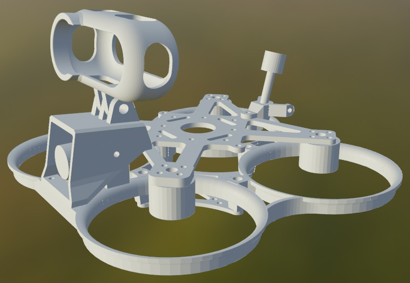
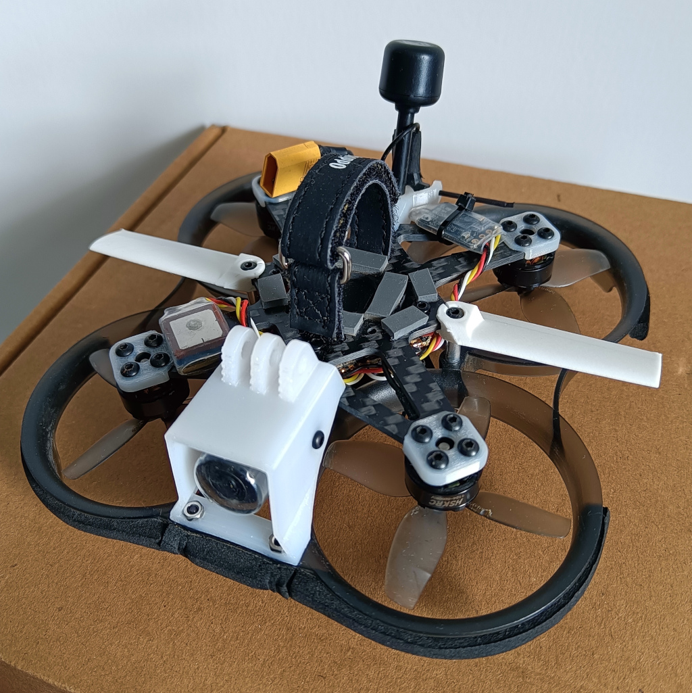

# 中文

追求可维护性的2寸圈圈机，适配19mm摄像头。

## 规格

* 轴距：95 毫米

* 桨叶尺寸：2 寸

* 电机孔位：9 毫米

* 飞控孔位：25.5 毫米、20 毫米

* 图传孔位：25.5 毫米、20 毫米

* 重量：小于35克

## 装配指南

### 必要零件

* 14 毫米 M2 螺柱 * 4 (推荐直径 3.5 毫米)

* 各种长度的 M2 螺丝 * 若干

* M2 螺帽 * 2

### 示意图

## 版权

禁止二次售卖图纸。

# English

A low-maintenance 2-inch cinewhoop, compatible with 19mm cameras.

## Specification

* Wheelbase: 95mm

* Prop size: 2 inches

* Motor hole size: 9mm

* FC hole size: 25.5mm, 20mm

* VTX hole size: 25.5mm, 20mm

* Weight: < 35g

## Assembly instructions

### Requisite hardware

* M2 stud with length of 14cm * 4 (diameter of 3.5mm recommended)

* M2 bolt with various lengths * N

* M2 nut * 2

### Snapshot

## Copyright

You are not allowed to resell the blueprint.
